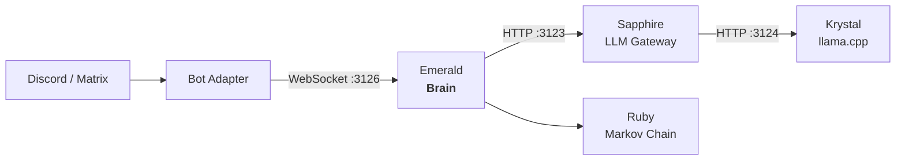

<p align="center">
  <picture>
    <source media="(prefers-color-scheme: dark)" srcset="images/logo.webp">
    
  </picture>
  <h1 align="center">Emerald</h1>
  <p align="center">The brain and decision-making engine for the Luna Protocol ecosystem</p>
  <p align="center">
    <a href="https://github.com/protocol-luna/emerald/blob/main/LICENSE">
      
    </a>
    <a href="https://www.typescriptlang.org/">
      
    </a>
    <a href="https://github.com/protocol-luna/emerald/actions">
      
    </a>
    <a href="https://nodejs.org/">
      
    </a>
    <a href="https://github.com/protocol-luna">
      
    </a>
  </p>
</p>

Emerald sits between platform adapters (bots) and the Sapphire LLM gateway, handling behavior evaluation, Sapphire communication, response processing, and connection management.



## How It Works

1. Bots connect to Emerald via WebSocket on port 3126
2. Bots forward user messages as `MessageEvent`s (optionally with `debug: true`)
3. Emerald evaluates behavior rules (burst, typo, sleep, mannerisms, voice chance)
4. Emerald strips bot mentions from the text
5. Emerald calls Sapphire's `/v1/respond` via **streaming** — the response arrives token by token
6. **On the first token**, Emerald sends a `TypingCommand` to the bot — the typing indicator appears immediately
7. Remaining tokens are buffered; when complete, Sapphire returns final metadata
8. Emerald processes the response (applies typo/swap behavior, maps debug stats)
9. Emerald sends a `RespondCommand` back to the bot with `responseText`, optional `voice` flag, and optional `debugStats`
10. The bot sends the response text to the platform

## Components

### Core

- **`src/server.ts`** — WebSocket server handling bot connections, message events, and commands
- **`src/brain.ts`** — Central decision engine: evaluates behavior rules, calls Sapphire via streaming, applies typo/swap, routes decisions
- **`src/sapphire-client.ts`** — HTTP client for Sapphire (`ask` non-streaming, `askStream` SSE streaming)
- **`src/ruby-client.ts`** — HTTP client for Ruby (Markov chain) integration
- **`src/protocol.ts`** — Type definitions for WebSocket messages
- **`src/config.ts`** — YAML-based configuration management

### Behavior

- **`src/behavior/sleep.ts`** — Sleep schedule behavior (circadian rhythm)
- **`src/behavior/mannerisms.ts`** — Mannerism pattern injection (hesitation, burst, reactions)
- **`src/behavior/burst.ts`** — Burst message behavior
- **`src/behavior/typo.ts`** — Typo/letter-swap behavior and rate limiting

### State

- **`src/state/state.ts`** — State management (activity tracking, session limits)
- **`src/state/trigger.ts`** — Trigger evaluation (mentions, DMs, names, keywords, random)
- **`src/state/topic-fatigue.ts`** — Topic fatigue tracking

## Features

### Streaming + First-Token Typing

Emerald streams from Sapphire's SSE endpoint. The first token triggers an immediate `TypingCommand` to the bot — the user sees "typing..." before the model has finished generating.

### Centralized Behavior Config

All behavior decisions live in Emerald's `config.yml`:
- Typo chance & layout (azerty/qwerty)
- Letter swap chance
- Burst chance & delays
- Hesitation chance & word list
- Sleep schedules & timezone
- Topic fatigue thresholds
- Voice message chance
- Forget chance

### Ruby Markov Chain Integration

Every message is trained into Ruby's Markov chain. When configured, triggers like `random` or `spontaneous` use Ruby instead of the LLM — generating context-free, human-like messages at near-zero latency.

### Debug Mode

When `debug: true` is set on a `MessageEvent`, Sapphire returns token counts, timing, emotion state, and classification confidence. Emerald forwards these as `debugStats` in the respond command.

## Protocol

### Events (Bot → Emerald)

| Event | Description |
|-------|-------------|
| `MessageEvent` | `{ type: "message", id, client, channel, user, text, timestamp, isDM, mentions?, debug? }` |
| `ReadyEvent` | `{ type: "ready", client, userId, username }` |
| `BotMessageEvent` | `{ type: "bot_message", client, channel, text, timestamp }` |
| `PresenceEvent` | `{ type: "presence", client, status }` |

### Commands (Emerald → Bot)

| Command | Description |
|---------|-------------|
| `RespondCommand` | Response text with optional voice, debug stats, burst plan, hesitation |
| `TypingCommand` | Show typing indicator in channel |
| `SetPresenceCommand` | Update bot status/activity |
| `SpontaneousCommand` | Trigger spontaneous message generation |
| `ForgotCommand` | Silently drop the message |

## Configuration

Copy `config.example.yml` to `config.yml`. All behavior parameters are documented in the example file.

```yaml
port: 3126
sapphire_host: "127.0.0.1"
sapphire_port: 3123
sapphire_bot_username: "User"
names: ["Luna", "Pixie"]
random_chance: 0.015
ruby_enabled: true
ruby_reasons: ["random", "spontaneous"]
```

## Running

```bash
# Install
npm install

# Build (esbuild → self-cli.cjs)
npm run build

# Development
npm run dev

# Production (PM2)
npm run start
```
