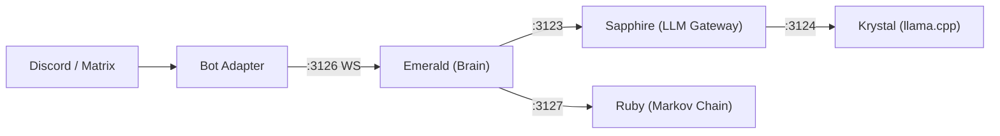

<p align="center">
  <picture>
    <source media="(prefers-color-scheme: dark)" srcset="images/logo.webp">
    
  </picture>
  <h1 align="center">Emerald</h1>
  <p align="center">The brain and decision-making engine for the Luna Protocol ecosystem</p>
  <p align="center">
    <a href="https://github.com/protocol-luna/emerald/blob/main/LICENSE">
      
    </a>
    <a href="https://www.typescriptlang.org/">
      
    </a>
    <a href="https://nodejs.org/">
      
    </a>
    <a href="https://github.com/protocol-luna">
      
    </a>
  </p>
</p>

Emerald sits between platform adapters (bots) and the Sapphire LLM gateway, handling behavior evaluation, Sapphire communication, response processing, and connection management. It's the centralized decision engine -- bots are thin adapters, all behavior logic lives here.



## How It Works

1. Bots connect to Emerald via WebSocket on port 3126
2. Bots forward user messages as `MessageEvent`s (optionally with `debug: true`)
3. Emerald evaluates behavior rules (burst, typo, sleep, mannerisms, voice chance)
4. Emerald strips bot mentions from the text
5. Emerald calls Sapphire's `/v1/respond` via **streaming** -- the response arrives token by token
6. **On the first token**, Emerald sends a `TypingCommand` to the bot -- the typing indicator appears immediately
7. Remaining tokens are buffered; when complete, Sapphire returns final metadata
8. Emerald processes the response (applies typo/swap behavior, maps debug stats)
9. Emerald sends a `RespondCommand` back to the bot with `responseText`, optional `voice` flag, and optional `debugStats`
10. The bot sends the response text to the platform

## Technical Overview

Emerald is **2,660 lines of TypeScript** across 15 source files, compiled via esbuild into a single `self-cli.cjs` bundle. It has zero runtime dependencies beyond `ws` (WebSocket) and `js-yaml` (config).

### Architecture

```
index.ts
  |-- config.ts (EmeraldConfig, loadConfig)
  |-- server.ts (EmeraldServer)
       |-- brain.ts (Brain) [590 lines -- the core]
       |    |-- behavior/sleep.ts      (circadian rhythm)
       |    |-- behavior/mannerisms.ts (delay, ignore, reaction, hesitation, forget)
       |    |-- behavior/burst.ts      (multi-fragment messages)
       |    |-- behavior/typo.ts       (keyboard typo + letter swap)
       |    |-- sapphire-client.ts     (LLM gateway HTTP client)
       |    |-- ruby-client.ts         (Markov chain HTTP client)
       |    |-- state/state.ts         (BrainState -- in-memory state)
       |    |-- state/topic-fatigue.ts (word repetition tracking)
       |    |-- state/trigger.ts       (trigger evaluation chain)
       |-- protocol.ts                 (all WebSocket message types)
       |-- client.ts                   (bot-side WebSocket library)
```

### Message Processing Pipeline

Every incoming message goes through this pipeline in `brain.ts:handleMessage()`:

```
1. Train Ruby (fire-and-forget)
2. evaluateMessage()          → TriggerResult (mention, dm, name, keyword, follow-up, random)
3. Check pause/stop/clear
4. Record activity + speaker
5. Check session limits       → auto-pause if > 8 rapid replies
6. evaluateSleep()            → "sleep" | "slow" | "short" | null
7. recordMessage()            → topic fatigue detection
8. computeDelay()             → reading time × inactivity × sleep × fatigue × jitter
9. shouldIgnore/Forget        → probabilistic filtering
10. shouldReact/Hesitate/Burst → behavior rolls
11. Pick reply style          → weighted random from config
12. Strip bot mentions        → removes @Username, <@userId>
13. Ruby or Sapphire?         → if ruby_reason: Ruby.generate(), else Sapphire.askStream()
14. applyTypo() / swap        → keyboard adjacency simulation
15. Assemble RespondCommand   → with all behavior annotations
```

### Decision Engine (`src/brain.ts`, 590 lines)

The Brain is a state machine that returns typed `Decision[]` objects rather than calling commands directly. Decisions include `respond`, `ignore`, `pause`, `unpause`, `clear`, and `forgot`. This keeps the brain testable and decoupled from the WebSocket transport.

**Spontaneous messages:** A per-client timer fires every 5 minutes. On each tick, there's a 12% chance to generate a message in a channel where the bot was recently active. These are generated via Ruby (Markov chain) for low-latency, bypassing the LLM entirely.

### Behavior System

**Sleep** (`src/behavior/sleep.ts`): Evaluates time-of-day schedules with midnight-crossing support. Three modes: `sleep` (ignore all but mentions), `slow` (3-5× delay), `short` (+30% ignore chance). The config.example.yml defines 6 daily periods.

**Mannerisms** (`src/behavior/mannerisms.ts`): All human-like timing and probability:
- `computeDelay()` -- starts with trigger-specific base delay, multiplies by reading time (text length / 500), inactivity warmup (up to 5× after 10 min idle), sleep mode, fatigue, and jitter (0.5-2×)
- `shouldIgnore()` -- trigger-type dependent, boosted by sleep and fatigue
- `shouldReact()` -- probability check, capped at 2% during slow/short sleep
- `shouldHesitate()` -- 15% chance to prepend "uh...", "um...", "well...", etc.
- `shouldForget()` -- 3% chance to silently drop the message

**Typos** (`src/behavior/typo.ts`): Keyboard adjacency maps for AZERTY and QWERTY. Replaces one letter in a random word (6% chance) or swaps adjacent letters (4% chance). Returns original and corrected word so the bot can optionally send a correction message.

**Burst** (`src/behavior/burst.ts`): 15% chance to split a response into 2-3 fragments with configured delays between them. Bot handles the actual text splitting.

### State Management (`src/state/state.ts`, 264 lines)

All state is in-memory Maps with no persistence. Key tracking:
- **Cooldowns:** per-channel `lastReply` timestamps for rate limiting
- **Activity:** per-channel `{ lastMessage, lastBotActivity, responseCount }`
- **Sessions:** per-channel pause/queue for session limits (8 rapid replies → 30s pause)
- **Follow-ups:** tracks last speaker per channel, budgets 3 consecutive follow-ups within 15s windows
- **Pruning:** periodic cleanup of entries older than 1 hour (every 5 min)

### Trigger Evaluation (`src/state/trigger.ts`, 193 lines)

Pure-functional evaluation chain with priority order:
1. Commands (`-stop`, `-start`, `-clear`)
2. Self-messages (skip)
3. **Mentions** → immediate trigger, unpauses
4. **DMs** → immediate trigger, unpauses
5. Paused state check
6. Cooldown check
7. **Name match** → any configured name in text
8. **Keyword match** → probabilistic (`keyword_chance`)
9. **Follow-up** → bot was last speaker, within window, under budget
10. **Random** → flat 1.5% chance

### Topic Fatigue (`src/state/topic-fatigue.ts`, 68 lines)

Per-channel word frequency tracking. Extracts words ≥4 characters from each message. When a word appears ≥3 times in the window (default 100 words), the bot gets "bored": delay multiplier scales up (up to 5×), ignore bonus adds +15%.

### Sapphire Client (`src/sapphire-client.ts`, 172 lines)

HTTP client for the LLM gateway. Two modes:
- `ask()` -- non-streaming POST to `/v1/respond`
- `askStream()` -- SSE streaming, calls `onChunk()` per token, returns final metadata

SSE parsing is custom line-by-line. The final JSON metadata event is the last `data:` line before `[DONE]`.

### Ruby Client (`src/ruby-client.ts`, 42 lines)

Fire-and-forget HTTP client for Markov chain:
- `train(event)` -- POST to `/train`, errors silently caught
- `generate(seed?, maxLength?, channelId?)` -- POST to `/generate`

Used for "ambient" messages (random and spontaneous triggers) where LLM latency is unnecessary.

### WebSocket Protocol (`src/protocol.ts`, 152 lines)

**Events (Bot → Emerald):**
| Type | Fields |
|------|--------|
| `MessageEvent` | `id, client, channel, user, username?, text, timestamp, isDM, mentions?, debug?` |
| `ReadyEvent` | `client, userId, username` |
| `BotMessageEvent` | `client, channel, text, timestamp` |
| `PresenceEvent` | `client, status` |

**Commands (Emerald → Bot):**
| Type | Fields |
|------|--------|
| `RespondCommand` | Full response + hesitationWord, burstPlan, typoCorrection, letterSwap, react, voice, debugStats |
| `TypingCommand` | `channel, duration` |
| `SetPresenceCommand` | `status, text?, activityType?` |
| `SpontaneousCommand` | `channel, sessionId` |
| `ForgotCommand` | `channel` |

Wire format: `{ event: "in", payload: InEvent }` → `{ event: "command", command: OutCommand }`

## Configuration

Copy `config.example.yml` to `config.yml`. All behavior parameters are documented in the example file.

```yaml
port: 3126
sapphire_host: "127.0.0.1"
sapphire_port: 3123
sapphire_bot_username: "User"
names: ["Luna", "Pixie"]
random_chance: 0.015
ruby_enabled: true
ruby_reasons: ["random", "spontaneous"]
```

## Running

```bash
# Install
npm install

# Build (esbuild → self-cli.cjs)
npm run build

# Development
npm run dev

# Production (PM2)
npm run start
```

## Stats

| Metric | Value |
|--------|-------|
| Source files | 15 |
| Lines of code | 2,660 |
| Runtime deps | `ws`, `js-yaml` |
| Build tool | esbuild → `self-cli.cjs` |
| Message pipeline stages | ~15 per request |
| Simulated behaviors | 10 (delay, ignore, forget, hesitation, typo, swap, reaction, voice, follow-up, burst, fatigue) |
